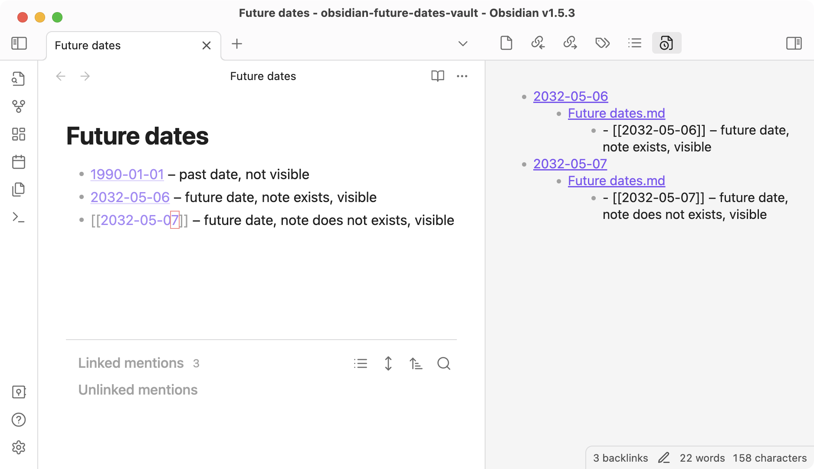

# Obsidian future dates plugin

Plugin creates a new view in the right panel that collects all links with future dates.
It is hepful to track all future tasks in one place.
This plugin uses "Daily notes" plugin to grab dates template.